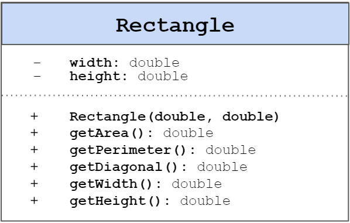

# Rectangle Class

In this exercise, we want to create a definitions of a rectangle (**class**) and, afterwards, create
a few instances (**objects**) out of it.

We'll start by taking a look at a class definition of a Rectangle:

With this image in mind:

1. The first area represents what the class name should be: **Rectangle**.
2. The second area represents the attributes (**fields**) the Rectangle class should have: **width**
   and **height**, and both should be of type **double**.
3. Last but not least, the third area contains the behavior (**methods**) of the Rectangle class.

Let's go through each one of those:

### - width: double and height: double

**Width** and **height** are the two properties that define a rectangle: **every** rectangle has to
have a width and height defined, and then you can calculate properties like **area**, **perimeter**
or
**diagonal** out of these properties. In our class, both properties should be of type **double**.

### + Rectangle(double, double)

This method, represented this way, represents the **class's constructor**. The class will have a
single constructor that receives both the width and height and set the instance's properties with
the received values.

> **Tip:** Since our class has a constructor defined, the default constructor (with no
> parameters) **won't be created** automatically for you! Whenever you define a constructor and
> you'd like to still have the default constructor, you have to declare it yourself. Don't worry
> though! We don't need it in our exercise.
>

### + getArea(): double

To find the area of a rectangle, just multiply the width times the height:
`Area = W x H`. Since we're using doubles on the equation, the **getArea()** should return the
result as a double as well.

### + getPerimeter(): double

The perimeter of a rectangle is defined as the sum of all sides. Since it has equal values on both
left-right sides and top-bottom sides, the perimeter can be defined as:
`Perimeter = 2W + 2H`.

### + getDiagonal(): double

To find the length of the diagonal of a rectangle, use the Pythagorean Theorem:
`Diagonal = √ (W² + H²)`.

In Java, to achieve the **power** of a number, you can use
the `Math.pow(double base, double exponent)`
method. [Official documentation](https://docs.oracle.com/javase/7/docs/api/java/lang/Math.html#pow(double,%20double))

To achieve the **square root**, you can use `Math.sqrt(double value)`
. [Official documentation](https://docs.oracle.com/javase/7/docs/api/java/lang/Math.html#sqrt(double))

### + getWidth(): double

This method should simply return the **width** of our rectangle.

### + getHeight(): double

This method should simply return the **height** of our rectangle.

> **Tip:** Since our class has no way to modify the width and the height - every of its methods
> are read-only, it makes sense to declare those fields as **final**. A **final** field cannot
> be changed once a value has been set to it. It's not necessary for our exercise though, so
> don't worry about it!
---

# Rectangle Objects

Now that we have our **Rectangle class** defined, we can move on to create **object instances** out
of it!

We'll be doing it in the **RectangleObjects** class. This class contains our **main method**.

Create a few different **instances objects** of the Rectangle class. Use the Rectangle constructor
to initialize the instances, passing different widths and heights. Call the method
`printRectangleProperties(Rectangle)` for each rectangle object you created on the main method.

---
Run the program! You should be getting outputs like this:

Keep in mind you can use your own values for width and height.

If you want to make sure your methods are returning the correct values, you can use any Rectangle
Calculator
[like this one](https://www.calculatorsoup.com/calculators/geometry-plane/rectangle.php), and make
sure your program outputs are correct.